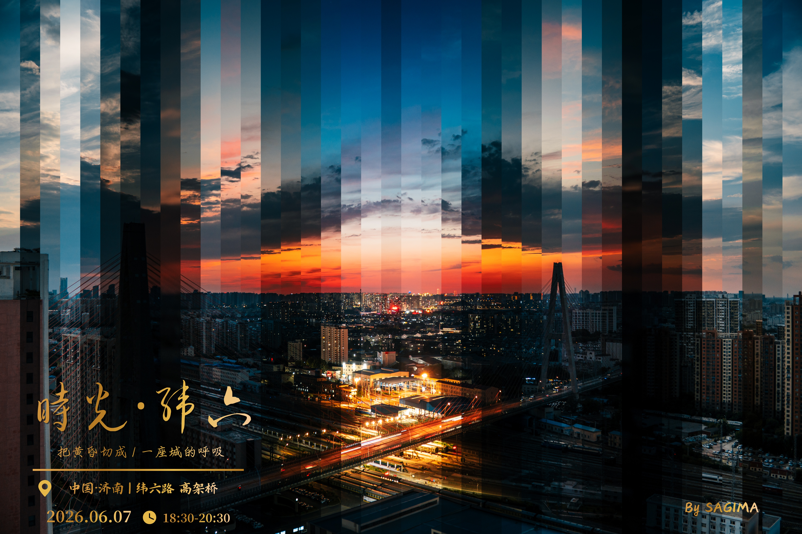

# 时间切片照片合成工具

一个运行在浏览器里的延时摄影切片拼接工具。上传一组按时间排序的照片后，可以生成类似日夜交替、天空变化、城市灯光渐变的时间切片成片。

项目当前是一个单文件 HTML 工具，无需安装依赖，也不需要后端服务。所有图片处理都在浏览器本地完成。

## 效果样张



## 功能特性

- 支持批量上传 JPG / PNG / WEBP 图片
- 图片默认按文件名自然排序，适合使用相机或导出软件生成的序列帧
- 支持两类拼接模式：
  - 扇形整图拼接：从可调中心点发散，将不同时刻照片裁成扇形区域后组合
  - 横向线性拼接：按竖条或横条切片，把多张照片按时间顺序拼成线性时间切片
- 支持极坐标径向重采样，用于生成更偏分析感、实验感的径向扫描效果
- 支持多种排序方式：
  - 文件名升序
  - 文件名降序
  - 当前列表顺序
  - 当前列表反转
  - 最新居中展开
  - 最早居中展开
- 可调输出尺寸、覆盖角度、起始方向、中心点、内外径、羽化、背景颜色、分隔线和序号标注
- 支持一键下载 PNG 成片
- 图片处理在本地浏览器完成，不会上传到服务器

## 快速开始

直接打开 `time_slice_photo_composer.html` 即可使用。

也可以使用一个本地静态服务预览：

```bash
python3 -m http.server 8766
```

然后在浏览器中打开：

```text
http://127.0.0.1:8766/time_slice_photo_composer.html
```

## 使用方法

1. 准备一组延时摄影照片，建议使用相同机位、相同尺寸或相同比例的图片。
2. 将图片文件名整理成可排序的序列，例如：

```text
frame-001.jpg
frame-002.jpg
frame-003.jpg
...
```

3. 打开网页，点击或拖拽上传图片。
4. 选择拼接模式：
   - 想要接近城市日夜扇形切片效果，选择“圆形/扇形”里的“扇形整图拼接”。
   - 想要传统横向时间条效果，选择“横向线性”。
5. 根据画面主体调整中心点、角度、羽化和排序方式。
6. 点击“渲染预览”。
7. 满意后点击“下载图片”导出 PNG。

## 模式说明

### 扇形整图拼接

这是推荐用于成片创作的模式。每张照片会被分配到一个扇形区域内，画面内容仍然保持原始照片的空间结构，因此更适合生成完整、可读的摄影作品。

适合场景：

- 城市天际线从白天到夜晚的变化
- 日出、日落、蓝调时刻
- 天空云层、光影、灯光变化
- 固定机位的风景或建筑延时

### 极坐标径向重采样

这个模式会按照输出画布上的角度和半径，把像素重新映射回原图的对应射线位置。它在数学上更接近极坐标扫描，不是传统摄影拼接，所以结果会更抽象。

适合场景：

- 实验视觉
- 径向扫描图
- 分析感或数据可视化风格的图像

如果目标是生成类似摄影作品的最终成片，优先使用“扇形整图拼接”。

### 横向线性拼接

第 N 张照片会取其自身宽度或高度的第 N 个切片区间，再映射到输出画布中。这个模式适合做经典的时间切片条带图。

适合场景：

- 天空颜色随时间变化
- 日落渐变
- 街景、人流、车流变化
- 横向或纵向排列的时间序列图

## 参数建议

扇形整图拼接：

- 输出尺寸：横版照片建议使用 `1920 × 1080` 或 `3840 × 2160`
- 覆盖角度：完整时间环使用 `360°`，局部展开可以使用 `120°` 到 `240°`
- 扇形中心：通常放在地平线附近、画面主体附近，参考图类效果可以从画面中部偏下开始
- 边缘羽化：`2°` 到 `5°` 通常比较自然
- 圆形遮罩：制作圆盘效果时打开；制作横版摄影成片时通常关闭

横向线性拼接：

- 输出宽度越大，条带越细腻
- 边缘羽化适合轻微使用，过高会让时间分界变糊
- 图片越多，时间变化越平滑

## 项目结构

```text
.
├── README.md
├── demo.jpg
└── time_slice_photo_composer.html
```

## 技术实现

- HTML / CSS / JavaScript 单文件实现
- 使用 Canvas 2D API 进行像素级合成
- 使用浏览器 File API 读取本地图片
- 无后端、无依赖、无构建流程

## 隐私说明

本工具在浏览器本地处理图片。除非你自行修改代码或部署额外服务，上传的照片不会被发送到服务器。

## 浏览器兼容性

建议使用最新版 Chrome、Edge、Safari 或 Firefox。

高分辨率输出会占用较多内存。如果处理大量 4K 图片时浏览器卡顿，可以先降低输出尺寸或减少一次上传的图片数量。

## 作者

由 SAGIMA 设计与维护。

- GitHub: [SA-GIMA](https://github.com/SA-GIMA)
- 小红书: [薄荷糖SAGIMA](https://www.xiaohongshu.com/user/profile/57a121165e87e70e0b1107a8?xsec_token=ABK9B1n150t68ujQIpNoqtM5XwQ6_w_UUvoVF5TGgc7Hc%3D&xsec_source=pc_search)
